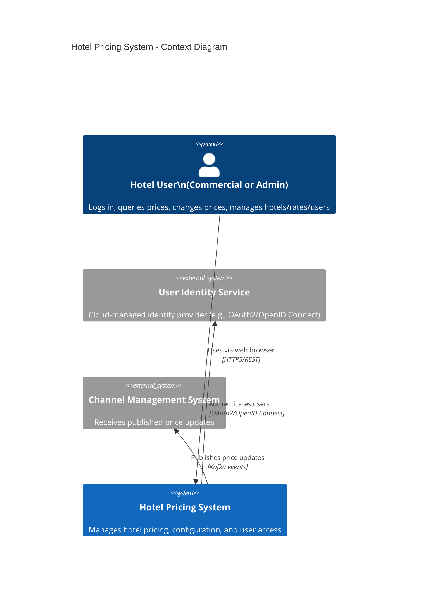

# Iteration 1: Establishing an Overall System Structure — View 3

**Extracted:** 2026-05-27T20:20:20.408917800

```mermaid
C4Context
title Hotel Pricing System - Context Diagram

Person(user, "Hotel User\n(Commercial or Admin)", "Logs in, queries prices, changes prices, manages hotels/rates/users")
System_Ext(uis, "User Identity Service", "Cloud-managed identity provider (e.g., OAuth2/OpenID Connect)")
System_Ext(cms, "Channel Management System", "Receives published price updates")

System(hps, "Hotel Pricing System", "Manages hotel pricing, configuration, and user access")

Rel(user, hps, "Uses via web browser", "HTTPS/REST")
Rel(hps, uis, "Authenticates users", "OAuth2/OpenID Connect")
Rel(hps, cms, "Publishes price updates", "Kafka events")
```