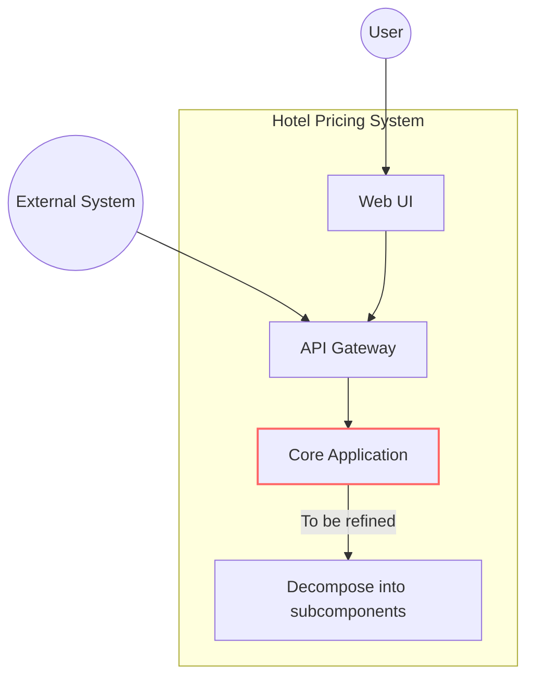

# Iteration 2: Identifying Structures to Support Primary Functionality — View 1

**Extracted:** 2026-05-27T20:20:20.408917800

```mermaid
graph TD
    subgraph Hotel Pricing System
        WebUI[Web UI]
        APIGateway[API Gateway]
        CoreApp[Core Application] -->|To be refined| CoreAppDecomp[Decompose into subcomponents]
    end

    User((User)) --> WebUI
    ExternalSystem((External System)) --> APIGateway

    WebUI --> APIGateway
    APIGateway --> CoreApp

    style CoreApp stroke:#f66,stroke-width:2px
```